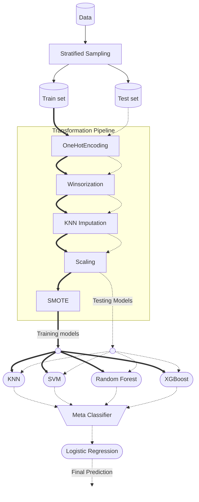

## E-commerce Customer Churn Prediction

<!-- ### Need for ML -->

### Method

Below is Full pipeline i used for the whole process : 



(Diagrams are made (programmed) in mermaid, hence a bit distorted ...)

bold lines - training set workflow

dashed lines - test set workflow 


### Reproducing the work

#### If you wanna connect api to your frontend

Run

```
docker pull maaz7409/churn_backend 
```

then run 

```
docker run -e ALLOWED_ORIGIN="your frontend url here" maaz7409/churn_backend
```

#### If you wanna run this locally and experiment with it

clone this repository 

```
git clone https://github.com/maaz7409/customer-churn-predictor.git
```


 and change ``` .env.example ``` to ``` .env ``` and add frontend and backend url to path variables as 

```
# In ./frontend/.env
VITE_BACKEND_URL='http://127.0.0.1:8000'
```

```
# In ./backend/.env
ALLOWED_ORIGIN='http://localhost:5173'
```

then, run 

```
docker compose --env-file ./frontend/.env --env-file ./backend/.env up --build
```